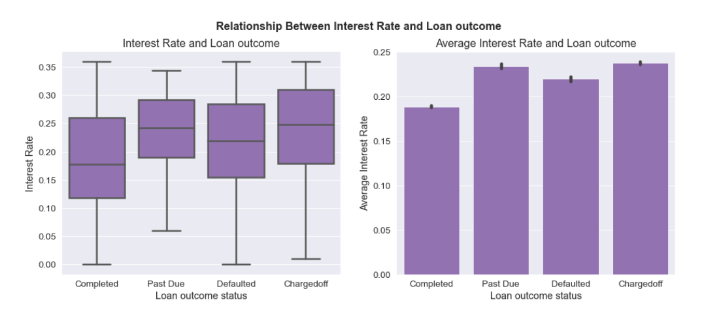
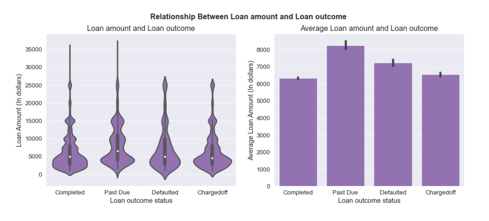

# Analysis of Prosper's Loan data

## 📜 Overview

The data consists of information regarding more than 100,000 loans on Prosper with more than 80 features.
The dataset can be found [here](https://www.google.com/url?q=https://s3.amazonaws.com/udacity-hosted-downloads/ud651/prosperLoanData.csv&sa=D&ust=1608053448414000&usg=AOvVaw3QHm2jzSaCPaBUbEvUXtSg),
with feature documentation available [here](https://docs.google.com/spreadsheets/d/1gDyi_L4UvIrLTEC6Wri5nbaMmkGmLQBk-Yx3z0XDEtI/edit#gid=0). We have selected some features of interest from the available 81 features, performed data cleaning to remove duplicates, missing values, and make the data more consistent for analysis. These changes were saved to a new dataset `prosper_loan_sub.csv`, which is attached along other project files.

## 🛠 Tools

- Done with Python using:
    - Numpy
    - Pandas
    - Matplotlib
    - Seaborn

## Sample visualizations

## Findings

- There is a strong positive relationship between interest rate and annual percentage rate (APR)
- There is a strong positive relationship between original loan amount and monthly loan payments.
- There is a moderate negative relationship between interest rate and the original loan amount.
- There is a linear positive relationship between interest rate and prosper ratings.
- Higher interest rates and lower loan amounts are associated with non-completed loans.
- Higher interest rates and lower loan amounts are associated with Higher-risk ratings.
- Both Higher-risk ratings and non-completed loans are associated with higher interest rates and lower loan amounts which may indicate that Prosper ratings are a good estimate for loan outcome.
